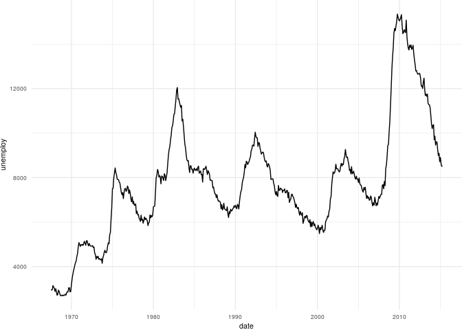

*2021-03-19, FCA Collin*

------------------------------------------------------------------------

<!--more-->
Dummy var
---------

``` r
#' Dummy Variable
#'
#' Decompose a factor-coercible variable into dummy variables.
#' 
#' @param x (`atomic`)
#' @export
#' @source <https://fcacollin.github.io/guide/utils_01/utils_01.html>
#' @md
#' @examples
#' # Use case data.frame.
#' head(iris)
#' head(dummy_var(iris$Species))
#' iris$sp <- dummy_var(iris$Species)
#' head(iris)
#' 
#' # With logical.
#' dummy_var(c(TRUE, FALSE))
#' 
#' # With character.
#' dummy_var(c("cat", "cat", "dog", "corgi", "corgi"))
#' 
dummy_var <- function(x) {
  stopifnot(is.atomic(x))
  if (!is.factor(x)) {
    x <- as.factor(x)
  }
  x <- droplevels(x)
  y <- stats::model.matrix(~ x + 0)
  colnames(y) <- levels(x)
  as.data.frame(y)
}
```

``` r
# Use case data.frame.
head(iris)
```

    ##   Sepal.Length Sepal.Width Petal.Length Petal.Width Species
    ## 1          5.1         3.5          1.4         0.2  setosa
    ## 2          4.9         3.0          1.4         0.2  setosa
    ## 3          4.7         3.2          1.3         0.2  setosa
    ## 4          4.6         3.1          1.5         0.2  setosa
    ## 5          5.0         3.6          1.4         0.2  setosa
    ## 6          5.4         3.9          1.7         0.4  setosa

``` r
head(dummy_var(iris$Species))
```

    ##   setosa versicolor virginica
    ## 1      1          0         0
    ## 2      1          0         0
    ## 3      1          0         0
    ## 4      1          0         0
    ## 5      1          0         0
    ## 6      1          0         0

``` r
iris$sp <- dummy_var(iris$Species)
head(iris)
```

    ##   Sepal.Length Sepal.Width Petal.Length Petal.Width Species sp.setosa
    ## 1          5.1         3.5          1.4         0.2  setosa         1
    ## 2          4.9         3.0          1.4         0.2  setosa         1
    ## 3          4.7         3.2          1.3         0.2  setosa         1
    ## 4          4.6         3.1          1.5         0.2  setosa         1
    ## 5          5.0         3.6          1.4         0.2  setosa         1
    ## 6          5.4         3.9          1.7         0.4  setosa         1
    ##   sp.versicolor sp.virginica
    ## 1             0            0
    ## 2             0            0
    ## 3             0            0
    ## 4             0            0
    ## 5             0            0
    ## 6             0            0

``` r
# With logical.
dummy_var(c(TRUE, FALSE))
```

    ##   FALSE TRUE
    ## 1     0    1
    ## 2     1    0

``` r
# With character.
dummy_var(c("cat", "cat", "dog", "corgi", "corgi"))
```

    ##   cat corgi dog
    ## 1   1     0   0
    ## 2   1     0   0
    ## 3   0     0   1
    ## 4   0     1   0
    ## 5   0     1   0

Matrix To Long Format
---------------------

``` r
#' Matrix-like Data To Long Data Frame
#'
#' Transform a matrix-like data set into a long data frame.
#'
mat_to_long_df <- function(x, ...) {
  UseMethod("mat_to_long_df", x)
}

mat_to_long_df.matrix <- function(x, names = c("row", "col", "value"), ...) {
  
  assertthat::assert_that(length(names) == 3L)
  if (is.null(colnames(x))) colnames(x) <- as.character(seq_len(ncol(x)))
  if (is.null(rownames(x))) rownames(x) <- as.character(seq_len(nrow(x)))

  y <- data.frame(
    rownames(x)[c(row(x))],
    colnames(x)[c(col(x))],
    c(x),
    row.names = NULL
  )

  names(y) <- names
  y
}

mat_to_long_df.data.frame <- function(x, ...) {
  x <- as.matrix(x)
  mat_to_long_df(x, ...)
}

m <- matrix(
   c(
    11, 12,
    21, 22,
    31, 32
    ),
  nrow = 3, byrow = TRUE,
  dimnames = list(row = 1:3, col = 1:2)
)
df <- as.data.frame(m)

mat_to_long_df(m)
```

    ##   row col value
    ## 1   1   1    11
    ## 2   2   1    21
    ## 3   3   1    31
    ## 4   1   2    12
    ## 5   2   2    22
    ## 6   3   2    32

``` r
mat_to_long_df(df)
```

    ##   row col value
    ## 1   1   1    11
    ## 2   2   1    21
    ## 3   3   1    31
    ## 4   1   2    12
    ## 5   2   2    22
    ## 6   3   2    32

``` r
library(testthat)
test_that("mat_to_long_df names are used", {
  result <- mat_to_long_df(m, names = c("a", "b", "y"))
  expected <- data.frame(
    a = c("1", "2", "3", "1", "2", "3"),
    b = c("1", "1", "1", "2", "2", "2"),
    y = c(11, 21, 31, 12, 22, 32)
  )
  expect_identical(result, expected)
})
```

    ## Test passed 🎊

``` r
test_that("mat_to_long_df error if not 3 names provided", {
  expect_error(mat_to_long_df(m, names = "a"))
})
```

    ## Test passed 🎊

Set a theme for `ggplot2`
-------------------------

``` r
#' `ggplot` theme
#'
#' Compliance with journal requirements.
#' @param reset (`flag`).
#' @export
#'
theme_rpack <- function(reset = FALSE) {

  assertthat::assert_that(is.logical(reset))
  if (reset) {
    ggplot2::theme_set(ggplot2::theme_gray())
  } else {
    new_theme <- ggplot2::theme_minimal() +
      ggplot2::theme(
        line = ggplot2::element_line(color = "black"),
        legend.position = "bottom",
        legend.key.height = grid::unit(.3, "cm"),
        text = ggplot2::element_text(size = 8),
        plot.margin = ggplot2::margin(0, 0, 0, 0, "cm"),
        legend.margin = ggplot2::margin(0, 0, 0, 0, "cm")
      )
    ggplot2::theme_set(new_theme)
  }
}
```

``` r
library(ggplot2)
gg <- ggplot(economics, aes(date, unemploy)) + geom_line()
gg
```


``` r
theme_rpack()
gg
```



``` r
theme_rpack(reset = TRUE)
gg
```


``` r
sessionInfo()
```

    ## R version 4.0.4 (2021-02-15)
    ## Platform: x86_64-pc-linux-gnu (64-bit)
    ## Running under: Debian GNU/Linux 10 (buster)
    ## 
    ## Matrix products: default
    ## BLAS:   /usr/lib/x86_64-linux-gnu/openblas/libblas.so.3
    ## LAPACK: /usr/lib/x86_64-linux-gnu/libopenblasp-r0.3.5.so
    ## 
    ## locale:
    ##  [1] LC_CTYPE=en_GB.UTF-8       LC_NUMERIC=C              
    ##  [3] LC_TIME=en_GB.UTF-8        LC_COLLATE=en_GB.UTF-8    
    ##  [5] LC_MONETARY=en_GB.UTF-8    LC_MESSAGES=en_GB.UTF-8   
    ##  [7] LC_PAPER=en_GB.UTF-8       LC_NAME=C                 
    ##  [9] LC_ADDRESS=C               LC_TELEPHONE=C            
    ## [11] LC_MEASUREMENT=en_GB.UTF-8 LC_IDENTIFICATION=C       
    ## 
    ## attached base packages:
    ## [1] stats     graphics  grDevices utils     datasets  methods   base     
    ## 
    ## other attached packages:
    ## [1] ggplot2_3.3.3  testthat_3.0.2
    ## 
    ## loaded via a namespace (and not attached):
    ##  [1] highr_0.9         compiler_4.0.4    pillar_1.6.0      tools_4.0.4      
    ##  [5] digest_0.6.27     pkgload_1.1.0     evaluate_0.14     lifecycle_1.0.0  
    ##  [9] tibble_3.1.1      gtable_0.3.0      pkgconfig_2.0.3   rlang_0.4.11     
    ## [13] DBI_1.1.1         cli_2.5.0         rstudioapi_0.13   yaml_2.2.1       
    ## [17] xfun_0.22         withr_2.4.1       stringr_1.4.0     dplyr_1.0.5      
    ## [21] knitr_1.33        generics_0.1.0    desc_1.3.0        vctrs_0.3.8      
    ## [25] tidyselect_1.1.1  rprojroot_2.0.2   grid_4.0.4        glue_1.4.2       
    ## [29] R6_2.5.0          fansi_0.4.2       rmarkdown_2.6     farver_2.1.0     
    ## [33] purrr_0.3.4       magrittr_2.0.1    scales_1.1.1      ps_1.6.0         
    ## [37] htmltools_0.5.1.1 ellipsis_0.3.2    assertthat_0.2.1  colorspace_2.0-1 
    ## [41] labeling_0.4.2    utf8_1.2.1        stringi_1.5.3     munsell_0.5.0    
    ## [45] crayon_1.4.1
