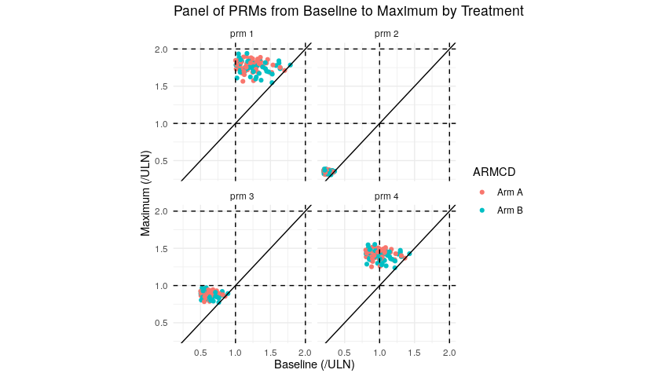
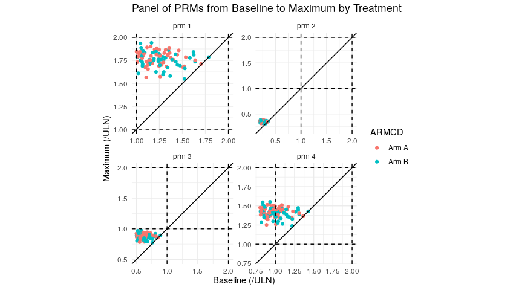

*2021-07-02, FCA Collin*

<!--more-->
``` r
library(tidyverse)
```

    ## ── Attaching packages ─────────────────────────────────────────────────────────────── tidyverse 1.3.0 ──

    ## ✔ ggplot2 3.3.3     ✔ purrr   0.3.4
    ## ✔ tibble  3.1.1     ✔ dplyr   1.0.5
    ## ✔ tidyr   1.1.3     ✔ stringr 1.4.0
    ## ✔ readr   1.4.0     ✔ forcats 0.5.1

    ## ── Conflicts ────────────────────────────────────────────────────────────────── tidyverse_conflicts() ──
    ## ✖ dplyr::filter() masks stats::filter()
    ## ✖ dplyr::lag()    masks stats::lag()

``` r
# Simulated adlb
adlb <- expand.grid(
  USUBJID = paste("subj", 1:50),
  AVISITN = 0:10,
  ARMCD = paste("Arm", c("A", "B")),
  PARAMCD = "prm 1"
)

adlb$AVISIT <- paste("VST", adlb$AVISIT)
adlb <- do.call(
  rbind,
  lapply(
    X = split(adlb, f = adlb$AVISITN),
    FUN = function(x) {
      x$AVAL <- rbeta(nrow(x), (unique(x$AVISITN) + 2)*0.5, 4) + 1
      x
    })
)

adlb <- rbind(
  adlb,
  within(adlb, {PARAMCD = "prm 2"; AVAL = 0.2 * AVAL}),
  within(adlb, {PARAMCD = "prm 3"; AVAL = 0.5 * AVAL}),
  within(adlb, {PARAMCD = "prm 4"; AVAL = 0.8 * AVAL})
)
```

Proposed preprocessing
======================

``` r
## Identify Max visit if not already done in ADLB
lb_max <- adlb %>%
  group_by(USUBJID, PARAMCD, ARMCD) %>%
  slice(which.max(AVAL)) %>%
  mutate(AVISIT = "MAX") %>%
  ungroup()

## Identify Baseline visit if not already done in ADLB
lb_bl <- adlb %>%
  group_by(USUBJID, ARMCD) %>%
  filter(AVISITN == 0) %>% # Change if Baseline differently identifed e.g. ABLFL
  mutate(AVISIT = "BL") %>%
  ungroup()

## Combine baseline and max in Analysis DataSet [ads]
ads <- bind_rows(lb_max, lb_bl)
```

Graph
=====

``` r
## Simple
ads_plot <- pivot_wider(ads, names_from = AVISIT, values_from = AVAL, -AVISITN)

gg <- ggplot(data = ads_plot, mapping = aes(x = BL, y = MAX, color = ARMCD)) +
  geom_point() +
  geom_abline(intercept = 0, slope = 1) + 
  geom_hline(yintercept = 1:2, lty = 2) +
  geom_vline(xintercept = 1:2, lty = 2) +
  facet_wrap(. ~ PARAMCD) +
  ggtitle("Panel of PRMs from Baseline to Maximum by Treatment") +
  xlab("Baseline (/ULN)") +
  ylab("Maximum (/ULN)") +
  theme_minimal() + 
  theme(asp = 1)
gg
```



``` r
## Independent scales in facets

### Identify Min / Max values in ads to keep asp = 1
ads_lim <- split(ads, f = ads[c("ARMCD", "PARAMCD")])
ads_lim <- lapply(
  X = ads_lim,
  FUN = function(x) {
    df <- unique(x[c("ARMCD", "PARAMCD")])
    row.names(df) <- NULL
    cbind(
      df,
      AVISIT = unname(rep(unique(x$AVISIT), 2)),
      range = rep(c("min", "max"), each = 2) ,
      AVAL = rep(range(x$AVAL), each = 2)
    )
  }
)
ads_lim <- do.call(bind_rows, ads_lim) %>%
  pivot_wider(names_from = AVISIT, values_from = AVAL)

### Update figure
gg <- ggplot(data = ads_lim, mapping = aes(x = BL, y = MAX, color = ARMCD)) +
  geom_blank() +
  geom_point(data = ads_plot, mapping = aes(x = BL, y = MAX, color = ARMCD)) +
  geom_abline(intercept = 0, slope = 1) + 
  geom_hline(yintercept = 1:2, lty = 2) +
  geom_vline(xintercept = 1:2, lty = 2) +
  facet_wrap(. ~ PARAMCD, scales = "free") +
  ggtitle("Panel of PRMs from Baseline to Maximum by Treatment") +
  xlab("Baseline (/ULN)") +
  ylab("Maximum (/ULN)") +
  theme_minimal() + 
  theme(asp = 1)
gg
```



``` r
sessionInfo()
```

    ## R version 4.0.4 (2021-02-15)
    ## Platform: x86_64-pc-linux-gnu (64-bit)
    ## Running under: Debian GNU/Linux 10 (buster)
    ## 
    ## Matrix products: default
    ## BLAS:   /usr/lib/x86_64-linux-gnu/openblas/libblas.so.3
    ## LAPACK: /usr/lib/x86_64-linux-gnu/libopenblasp-r0.3.5.so
    ## 
    ## locale:
    ##  [1] LC_CTYPE=en_GB.UTF-8       LC_NUMERIC=C              
    ##  [3] LC_TIME=en_GB.UTF-8        LC_COLLATE=en_GB.UTF-8    
    ##  [5] LC_MONETARY=en_GB.UTF-8    LC_MESSAGES=en_GB.UTF-8   
    ##  [7] LC_PAPER=en_GB.UTF-8       LC_NAME=C                 
    ##  [9] LC_ADDRESS=C               LC_TELEPHONE=C            
    ## [11] LC_MEASUREMENT=en_GB.UTF-8 LC_IDENTIFICATION=C       
    ## 
    ## attached base packages:
    ## [1] stats     graphics  grDevices utils     datasets  methods   base     
    ## 
    ## other attached packages:
    ## [1] forcats_0.5.1   stringr_1.4.0   dplyr_1.0.5     purrr_0.3.4    
    ## [5] readr_1.4.0     tidyr_1.1.3     tibble_3.1.1    ggplot2_3.3.3  
    ## [9] tidyverse_1.3.0
    ## 
    ## loaded via a namespace (and not attached):
    ##  [1] tidyselect_1.1.1  xfun_0.22         haven_2.4.1       colorspace_2.0-1 
    ##  [5] vctrs_0.3.8       generics_0.1.0    htmltools_0.5.1.1 yaml_2.2.1       
    ##  [9] utf8_1.2.1        rlang_0.4.11      pillar_1.6.0      withr_2.4.1      
    ## [13] glue_1.4.2        DBI_1.1.1         dbplyr_2.0.0      modelr_0.1.8     
    ## [17] readxl_1.3.1      lifecycle_1.0.0   munsell_0.5.0     gtable_0.3.0     
    ## [21] cellranger_1.1.0  rvest_1.0.0       evaluate_0.14     labeling_0.4.2   
    ## [25] knitr_1.33        ps_1.6.0          fansi_0.4.2       highr_0.9        
    ## [29] broom_0.7.6       Rcpp_1.0.6        scales_1.1.1      backports_1.2.1  
    ## [33] jsonlite_1.7.2    farver_2.1.0      fs_1.5.0          hms_1.0.0        
    ## [37] digest_0.6.27     stringi_1.5.3     grid_4.0.4        cli_2.5.0        
    ## [41] tools_4.0.4       magrittr_2.0.1    crayon_1.4.1      pkgconfig_2.0.3  
    ## [45] ellipsis_0.3.2    xml2_1.3.2        reprex_1.0.0      lubridate_1.7.10 
    ## [49] assertthat_0.2.1  rmarkdown_2.6     httr_1.4.2        rstudioapi_0.13  
    ## [53] R6_2.5.0          compiler_4.0.4
